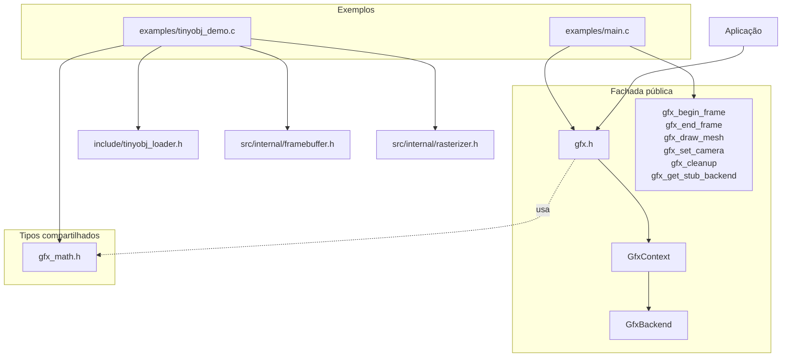
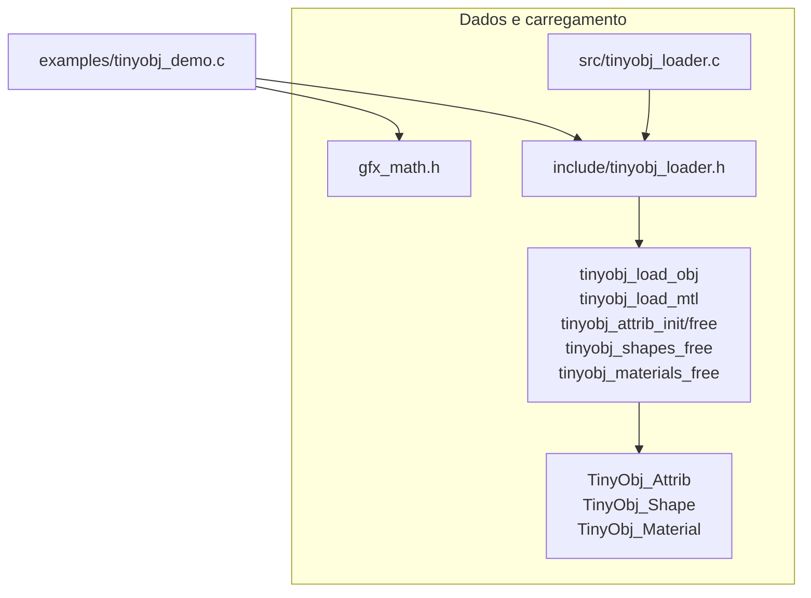
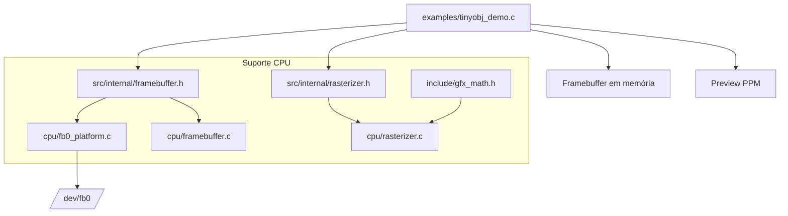
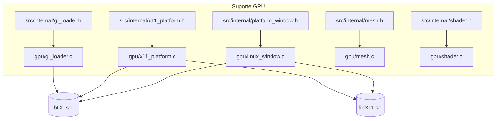

# gfx — API gráfica em C puro

Biblioteca de renderização 2D/3D escrita em C99, organizada em uma fachada pública pequena e em módulos de suporte para math, framebuffer, rasterização, OBJ/MTL e integração dinâmica com GL/X11.

Hoje o contrato público vive em `include/` e o suporte interno fica em `src/internal/`; os helpers específicos dos exemplos ficam em `examples/`. A documentação abaixo separa essas fronteiras para deixar claro o que é contrato público e o que ainda é suporte interno ou esboço de backend.

Uma síntese visual adicional está em [svg/dual_backend_architecture.svg](svg/dual_backend_architecture.svg), mas as visões Mermaid abaixo são a referência principal desta documentação.

   

> [!TIP]
> O contrato público vive em `include/gfx.h`, `include/gfx_math.h` e `include/tinyobj_loader.h`. O restante da árvore apoia esse contrato, fica em `src/internal/` ou serve apenas aos exemplos.

## Estrutura do projeto

```
gfx/
├── include/                ← headers públicos estáveis (`gfx.h`, `gfx_math.h`, `tinyobj_loader.h`)
├── cpu/                    ← framebuffer Linux e rasterização software
├── gpu/                    ← carregamento dinâmico GL/X11 e stubs GPU
├── src/                    ← implementação comum, parser OBJ/MTL e stubs
│   └── internal/           ← headers privados de suporte
├── examples/               ← smoke tests, demos e helpers locais
├── svg/                    ← artefatos visuais auxiliares
└── CMakeLists.txt
```

## 🧭 Visão geral da arquitetura

A documentação foi particionada em quatro visões: fachada pública, dados/carregamento, CPU/framebuffer e GPU/dlopen. Cada diagrama é legível por si só e termina apontando para a próxima camada mais específica.

### 1. 🏛️ Fachada pública e pontos de entrada

`gfx.h` concentra o contrato estável do projeto. `GfxContext` guarda o backend escolhido pela aplicação e despacha as chamadas para `GfxBackend`; os exemplos mostram dois usos diferentes: `examples/main.c` exercita o dispatcher com o backend stub, enquanto `examples/tinyobj_demo.c` usa os módulos de suporte para gerar uma prévia do OBJ em CPU.



Próxima visão: dados compartilhados e parser OBJ/MTL.

### 2. 🧱 Dados compartilhados e parser OBJ/MTL

`include/gfx_math.h` fornece os tipos geométricos e o `Framebuffer` usado pelos módulos de suporte. `include/tinyobj_loader.h` é o parser de OBJ/MTL em estilo header-only; `src/tinyobj_loader.c` apenas habilita a implementação. Essa camada produz `TinyObj_Attrib`, `TinyObj_Shape` e `TinyObj_Material`, que alimentam as demos e os módulos de rasterização.



Detalhado em: suporte CPU e framebuffer.

### 3. 🖥️ Suporte CPU e framebuffer

A camada `cpu/` e `src/internal/framebuffer.h` cobre o caminho software. `cpu/fb0_platform.c` abre e escreve em `/dev/fb0`; `cpu/framebuffer.c` fecha e limpa a superfície; `cpu/rasterizer.c` desenha triângulos com z-buffer usando os tipos de `include/gfx_math.h`. A demo `examples/tinyobj_demo.c` usa essas primitivas para renderizar em memória e exportar um PPM.



Detalhado em: suporte GPU e carregamento dinâmico.

### 4. 🧩 Suporte GPU, janela Linux e carregamento dinâmico

Os arquivos em `gpu/` formam a camada de infraestrutura de integração. `gpu/gl_loader.c` resolve os símbolos OpenGL usados pelo projeto em runtime; `gpu/x11_platform.c` carrega X11/GLX dinamicamente; `gpu/linux_window.c` monta a janela nativa Linux, processa eventos e apresenta os frames; `gpu/mesh.c` carrega OBJ/MTL em estruturas próprias e `gpu/shader.c` compila e destrói programas GLSL quando há contexto GL disponível. Isso ainda não é um pipeline GPU completo, mas já cobre a janela nativa e os blocos de suporte.



Detalhado em: API atual e notas de implementação.

## ✨ API atual

A superfície estável do projeto está em `include/gfx.h`, `include/gfx_math.h` e `include/tinyobj_loader.h`. O restante dos headers é suporte técnico ou infraestrutura de integração.

### `gfx.h`
- `GfxBackend` e `GfxContext`
- `gfx_begin_frame`, `gfx_end_frame`
- `gfx_draw_mesh`, `gfx_set_camera`
- `gfx_cleanup`
- `gfx_get_stub_backend`

### Tipos compartilhados em `include/gfx_math.h`
- `Framebuffer`
- `Vec2`, `Vec3`, `Vec4`, `Mat4`
- `gfx_min`, `gfx_max`, `gfx_fminf`, `gfx_fmaxf`
- `vec3_min`, `vec3_max`, `vec3_clamp`
- `gfx_edge2d`, `vec3_to_rgba`

### Suporte CPU em `src/internal/framebuffer.h` e `src/internal/rasterizer.h`
- `gfx_fb_open`, `gfx_fb_close`
- `gfx_fb_set_pixel`, `gfx_fb_clear`
- `gfx_rasterize_triangle`

### Suporte GPU em `src/internal/gl_loader.h`, `src/internal/x11_platform.h`, `src/internal/mesh.h` e `src/internal/shader.h`
- `GLProcs`, `gfx_gl_load`
- `PlatformGL`, `gfx_platform_gl_init`, `gfx_platform_gl_close`
- `gfx_mesh_load`, `gfx_mesh_free`
- `gfx_shader_create_from_source`, `gfx_shader_destroy`

### Suporte de janela Linux em `src/internal/platform_window.h`
- `PlatformWindow`, `gfx_platform_window_create`, `gfx_platform_window_destroy`
- `gfx_platform_window_pump_events`, `gfx_platform_window_should_close`
- `gfx_platform_window_set_clear_color`, `gfx_platform_window_context`

Observação: esses helpers já executam trabalho real de carregamento e destruição, e a camada de janela Linux agora também existe como backend mínimo de apresentação. O pipeline GPU completo ainda não está pronto.

### Parser OBJ/MTL em `include/tinyobj_loader.h`
- `tinyobj_load_obj`, `tinyobj_load_mtl`
- `tinyobj_attrib_init`, `tinyobj_attrib_free`
- `tinyobj_shapes_free`, `tinyobj_materials_free`
- `tinyobj_attrib_get_vertex`, `tinyobj_attrib_compute_bounds`
- `tinyobj_material_color`, `tinyobj_project_vertex`
- `tinyobj_save_preview_ppm` (`src/tinyobj_preview.c`)

### Utilitários de filesystem em `examples/tinyobj_utils.h`
- `tinyobj_get_executable_path`
- `tinyobj_strip_basename`, `tinyobj_copy_path`, `tinyobj_join_path`
- `tinyobj_read_file`
- `tinyobj_default_file_reader`

## ▶️ Uso básico

```c
#include "gfx.h"

int main(void) {
    GfxContext ctx = {
        .backend = gfx_get_stub_backend(),
        .backend_ctx = NULL,
    };

    Mat4 model = {
        .col = {
            { 1, 0, 0, 0 },
            { 0, 1, 0, 0 },
            { 0, 0, 1, 0 },
            { 0, 0, 0, 1 },
        },
    };

    gfx_begin_frame(&ctx);
    gfx_set_camera(&ctx, (Vec3){0, 1, 3}, (Vec3){0, 0, 0}, 60.0f);
    gfx_draw_mesh(&ctx, NULL, model, NULL);
    gfx_end_frame(&ctx);
    gfx_cleanup(&ctx);
    return 0;
}
```

## 🛠️ Compilação

Recomendado (CMake):

```bash
cmake -B build -DCMAKE_BUILD_TYPE=Release
cmake --build build
```

Troque `Release` por `Debug` quando quiser reproduzir a matriz de validação usada na CI.

O `CMakeLists.txt` gera três alvos principais: `gfx_demo`, `tinyobj_demo` e `gfx_window_demo`. O `Makefile` da raiz apenas delega para esses passos.

## 🚀 Executando os exemplos

- `./build/gfx_demo` executa o smoke test da fachada pública usando `gfx_get_stub_backend()`.
- `./build/tinyobj_demo [modelo.obj] [saida.ppm]` carrega OBJ/MTL e grava uma prévia em PPM; se nenhum argumento for passado, ele resolve caminhos padrão a partir do diretório do executável.
- `./build/gfx_window_demo` abre uma janela nativa Linux com contexto GLX e apresenta frames simples; em ambiente headless, rode-o sob `xvfb-run`.

## ⚙️ Dependências em tempo de execução

- Linux, porque o projeto usa `/dev/fb0` e `linux/fb.h` no caminho CPU.
- `libdl` no link, para `dlopen`/`dlsym`.
- `libGL.so.1` e `libX11.so` para `gfx_window_demo` e para os módulos GPU de suporte.
- Uma sessão X11 com `DISPLAY` válido para o backend de janela Linux; em modo headless, use `xvfb-run`.
- Acesso ao framebuffer do sistema somente se a aplicação chamar `gfx_fb_open("/dev/fb0")`; normalmente isso exige root ou permissão no grupo `video`.

## 🔎 Notas técnicas

- `src/stubs.c` implementa a fachada pública atual e o backend stub.
- `src/tinyobj_loader.c` existe para compilar a implementação que mora no header `include/tinyobj_loader.h`.
- `src/tinyobj_preview.c` concentra o helper de preview em PPM e depende de `cpu/rasterizer.c`.
- `examples/tinyobj_utils.h` concentra helpers de filesystem usados pelos exemplos e pelo carregamento padrão.
- `examples/main.c` é um exemplo mínimo de despacho.
- `examples/tinyobj_demo.c` usa um framebuffer em memória e exporta um PPM; ele não depende de X11.

## 🗺️ Roadmap

### ✅ Já presente

- Math library (vec/mat/quat)
- Framebuffer `/dev/fb0` (CPU)
- Rasterizador por software e z-buffer
- Clipping (Sutherland–Hodgman)
- Loader GL via `dlopen`
- Backend de janela Linux + contexto GLX básico
- Parser `.obj` próprio
- Demos e exemplos

### 🔭 Próximos passos

- Adicionar texturas com correção perspectiva
- Adicionar iluminação Phong
- Adicionar sombras
- Expandir a renderização do backend de janela para desenhar malhas reais
- Avaliar um backend Wayland
- Avaliar suporte Windows/WGL

## 📜 Licença

Veja [LICENSE](LICENSE) — MIT License.
