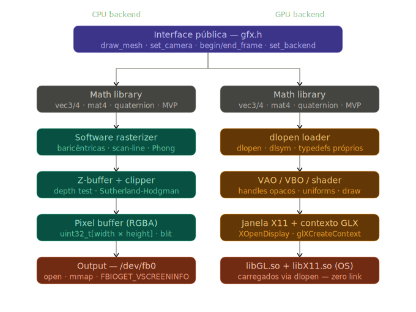

# gfx — API gráfica em C puro

Biblioteca de renderização 2D/3D escrita em C99, sem dependências de terceiros em tempo de compilação.
Fornece dois backends intercambiáveis em runtime:

- **CPU** — rasterizador por software, desenha diretamente em `/dev/fb0` (framebuffer do kernel).
- **GPU** — usa OpenGL carregado dinamicamente via `dlopen` e cria janela/contexto via X11/GLX.



## Estrutura do projeto

```
gfx/
├── gfx.h                   ← API pública unificada para ambos os backends
├── gfx_math.h              ← biblioteca math header-only (vec, mat, quat)
├── cpu/                    ← backend de software (rasterização, framebuffer)
├── gpu/                    ← backend OpenGL (dlopen + X11/GLX, VAO/VBO, shaders)
├── examples/               ← exemplos de uso / demo
├── include/                ← headers públicos e privados
├── src/                    ← implementação comum / stubs
└── CMakeLists.txt
```

## Dependências em tempo de execução

- `libdl` (`-ldl`) — usada na linkagem para permitir `dlopen`/`dlsym`.
- `libGL.so` (somente para backend GPU) — carregada dinamicamente em runtime;
- `libX11.so` (somente para backend GPU) — carregada dinamicamente para criar janelas/GLX.

Observação: não são incluídos headers do sistema para GL/X11; os tipos necessários são definidos internamente.

## Compilação

Recomendado (CMake):

```bash
cmake -B build -DCMAKE_BUILD_TYPE=Release
cmake --build build
```

Também existe `Makefile` em alguns setups; o projeto é intencionalmente simples e não usa `find_package(OpenGL)` nem `find_package(X11)`.

Requisitos para execução:

- Backend CPU: acesso a `/dev/fb0` (geralmente requer permissões de root ou configuração específica do sistema).
- Backend GPU: ambiente X11 disponível e `libGL.so`/`libX11.so` presentes no sistema.

## Executando a demo / exemplo

1. Compile (`cmake --build build`).
2. Execute o binário de exemplo gerado, por exemplo `./build/gfx_demo`.

Notas:

- Para usar o backend CPU, inicialize com `gfx_init(GFX_BACKEND_CPU)` no código (ou use o exemplo em `examples/` que já escolhe o backend).
- Para o backend GPU, execute o binário em uma sessão X (display válido) — caso contrário a criação do contexto falhará.

## Uso básico (exemplo)

```c
#include "gfx.h"

int main(void) {
    GfxContext *g = gfx_init(GFX_BACKEND_CPU); // ou GFX_BACKEND_GPU

    Mesh *mesh = gfx_mesh_load(g, "modelo.obj");

    while (gfx_should_run(g)) {
        gfx_begin_frame(g);

        gfx_set_camera(g,
            (Vec3){0, 1, 3}, // posição
            (Vec3){0, 0, 0}, // alvo
            60.0f            // fov em graus
        );

        Mat4 model = mat4_identity();
        gfx_draw_mesh(g, mesh, model, NULL);

        gfx_end_frame(g);
    }

    gfx_destroy(g);
    return 0;
}
```

## API pública — resumo

- `gfx_init(backend)` — inicializa o contexto (`GFX_BACKEND_CPU` | `GFX_BACKEND_GPU`).
- `gfx_destroy(ctx)` — libera recursos e fecha janela/framebuffer.
- `gfx_should_run(ctx)` — retorna `1` enquanto a aplicação deve continuar.
- `gfx_begin_frame(ctx)` / `gfx_end_frame(ctx)` — delimitam o frame.
- `gfx_set_camera(ctx, pos, target, fov)` — atualiza view/projection.
- `gfx_mesh_load(ctx, path)` / `gfx_mesh_free(ctx, mesh)` — gerenciamento de meshes.
- `gfx_draw_mesh(ctx, mesh, transform, material)` — enfileira draw call.

Consulte `gfx.h` para a documentação completa das funções e tipos.

## math — `gfx_math.h`

Fornece `Vec2/3/4`, `Mat4` (column-major), `Quat` e operações usuais (adição, normalização, multiplicação de matrizes, lookAt, perspectiva, etc.). Compatível com `glUniformMatrix4fv`.

## Backend CPU — notas técnicas

- O framebuffer é mapeado via `mmap` em `/dev/fb0` para escrita direta.
- A rasterização usa coordenadas baricêntricas com correção perspectiva e z-buffer.
- Clipping é feito por Sutherland–Hodgman contra os 6 planos do frustum.

## Backend GPU — notas técnicas

- `libGL.so` e `libX11.so` são carregadas dinamicamente com `dlopen`/`dlsym`.
- Os procs GL são resolvidos em runtime (ex.: `glGenBuffers`, `glBufferData`, `glCreateShader`, ...).
- Criação de janela/contexto é feita via X11/GLX carregados dinamicamente.

## Melhorias e Implementações (resumo)

Versão de documentação: 2026-03-26

- **Implementado:** biblioteca math (vec/mat/quat) — `gfx_math.h` e `src/gfx_math.c`.
- **Implementado:** acesso e mapeamento de framebuffer via `/dev/fb0` com `mmap` (backend CPU) — `cpu/fb0_platform.c`, `cpu/framebuffer.c`, `include/framebuffer.h`.
- **Implementado:** rasterizador por software com correção perspectiva e z-buffer — `cpu/rasterizer.c`, `include/rasterizer.h`.
- **Implementado:** clipping por Sutherland–Hodgman contra os 6 planos do frustum.
- **Implementado:** parser `.obj` próprio — `src/tinyobj_loader.c`, `include/tinyobj_loader.h`.
- **Implementado:** demos e exemplos — `examples/main.c`, `examples/tinyobj_demo.c`.
- **Implementado:** carregamento dinâmico de `libGL.so` e `libX11.so` via `dlopen`/`dlsym` (backend GPU) — `gpu/gl_loader.c`, `include/gl_loader.h`.
- **Implementado:** resolução de procs GL em runtime e gerenciamento básico de VAO/VBO — `gpu/mesh.c`, `gpu/shader.c`.
- **Implementado:** criação de janela/contexto via X11/GLX (GPU) — `gpu/x11_platform.c`, `include/x11_platform.h`.
- **Implementado:** integração e stubs de plataforma — `src/stubs.c`.
- **Implementado:** documentação de arquitetura — `svg/dual_backend_architecture.svg`.
- **Incluído / atualizado:** `CMakeLists.txt`, `Makefile`, `LICENSE`, `.gitignore`, e a API pública em `gfx.h`.

**Edições e novos arquivos (resumo)**

- `cpu/`: `fb0_platform.c`, `framebuffer.c`, `rasterizer.c`
- `gpu/`: `gl_loader.c`, `mesh.c`, `shader.c`, `x11_platform.c`
- `include/`: `framebuffer.h`, `gl_loader.h`, `mesh.h`, `rasterizer.h`, `shader.h`, `tinyobj_loader.h`, `x11_platform.h`
- `src/`: `gfx_math.c`, `tinyobj_loader.c`, `stubs.c`
- `examples/`: `main.c`, `tinyobj_demo.c`
- `svg/`: `dual_backend_architecture.svg`
- Outros: `CMakeLists.txt`, `Makefile`, `gfx.h`, `gfx_math.h`, `LICENSE`, `.gitignore`, `README.md`

Melhorias notáveis:

- Arquitetura de backends unificada via `gfx.h`, permitindo troca em runtime.
- Exemplo em `examples/main.c` demonstrando inicialização, camera e loop principal.

## Roadmap

- [x] Math library (vec/mat/quat)
- [x] Framebuffer `/dev/fb0` (CPU)
- [x] Rasterizador por software e z-buffer
- [x] Clipping (Sutherland–Hodgman)
- [x] Loader GL via `dlopen`
- [x] Janela X11 + contexto GLX
- [x] VAO/VBO management (GPU)
- [x] Parser `.obj` próprio
- [ ] Iluminação Phong
- [ ] Texturas com correção perspectiva
- [ ] Sombras (shadow map)
- [ ] Backend Wayland
- [ ] Port Windows (WGL)

## Licença

Veja [LICENSE](LICENSE) — MIT License.
